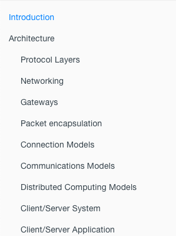
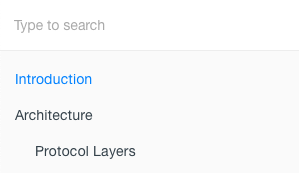
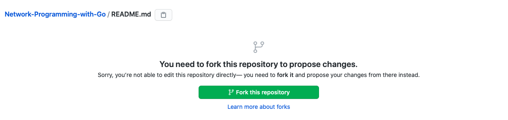
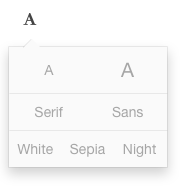

## 目标网站功能

- 这个网站是一个使用gitbook发布的图书，包含多个章节及其内容
   - 左侧是图书的导航栏，可以认为是书本的目录，点击对应的链接即可进入对应章节
   
   

   - 左侧导航栏上方是搜索框，可以搜索书的内容
   
   

   - 导航栏可以被收起
   
   

   - 点击EDIT会跳转到书本GitHub的Fork界面
   
   

   - 此外，书本的页面字体、字体大小以及主题颜色也可以选择
   
   

   
   - 点击右上角的GitHub图标会跳转到书本的GitHub主页
   
   

   

   
   - 在任何界面，点击上方灰色的章节名称，都会回到introduction页面
   
   

   
   - 浏览文章时可以通过`<`和`>`图标，跳到上一或者是下一页
   
   

   