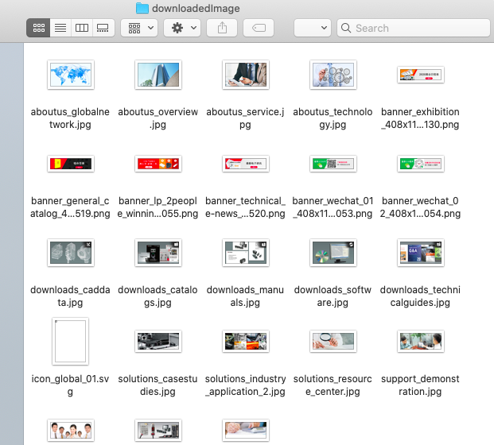

## Colly爬取图片的示例

在开始我们的项目之前，我们先来看一个使用colly爬取图片的例子

代码改编自[https://www.jianshu.com/p/cda08dde65cd](https://www.jianshu.com/p/cda08dde65cd)
```go
package main

import (
    "fmt"
    "github.com/gocolly/colly"
    "io"
    "net/http"
    "os"
    "strings"
)
// global variables
var destUrl string

// helper function to download images
func downloadImages(_ int, e *colly.HTMLElement) {
    srcRef := e.Attr("src")
    fullurl := destUrl + srcRef
    res, _ := http.Get(fullurl)
    h := strings.Split(srcRef, "/")
    savedPath := "./downloadedImage/" + h[len(h)-1]
    f, err := os.Create(savedPath)
    if(err != nil) {
        panic(err)
    } // if
    io.Copy(f, res.Body)
    fmt.Println(destUrl  + srcRef)
} // downloadImages

// main function
func main()  {
    c := colly.NewCollector()
    // 创建一个文件夹用于存放下载的图像
    os.Mkdir("./downloadedImage/", 0777)

    c.OnHTML("ul[class]", func(e *colly.HTMLElement) {
        e.ForEach("img[src]", downloadImages)
    })

    c.OnRequest(func(r *colly.Request) {
        fmt.Println("Visiting", r.URL)
    })

    destUrl = "https://www.keyence.com.cn"
    c.Visit(destUrl)
} // main
```

### 结果展示

<div align=center></div>