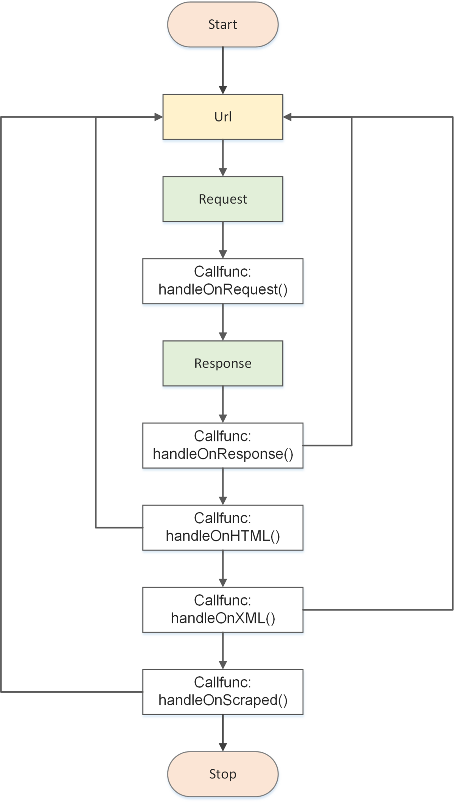

## 官方给出的示例

在这里仅作简单介绍，如要详细了解colly的源码，建议参阅[go爬虫框架colly源码以及软件架构分析](https://www.jianshu.com/p/93187b80541f)，本章节的部分内容亦选自此文

官方示例代码[http://go-colly.org/docs/examples/basic/](http://go-colly.org/docs/examples/basic/)
```go

package main

import (
    "fmt"

    "github.com/gocolly/colly"
)

func main() {
    // Instantiate default collector
    // 创建一个 Collector对象
    c := colly.NewCollector(
        // Visit only domains: hackerspaces.org, wiki.hackerspaces.org
        colly.AllowedDomains("hackerspaces.org", "wiki.hackerspaces.org"),
    )

    // On every a element which has href attribute call callback
    // 添加一个HTML的回调函数
    c.OnHTML("a[href]", func(e *colly.HTMLElement) {
        link := e.Attr("href")
        // Print link
        fmt.Printf("Link found: %q -> %s\n", e.Text, link)
        // Visit link found on page
        // Only those links are visited which are in AllowedDomains
        c.Visit(e.Request.AbsoluteURL(link))
    })

    // Before making a request print "Visiting ..."
    // 添加一个 Requset回调函数
    c.OnRequest(func(r *colly.Request) {
        fmt.Println("Visiting", r.URL.String())
    })

    // Start scraping on https://hackerspaces.org
    // 开始爬取
    c.Visit("https://hackerspaces.org/")
}
```
这是官方给的示例， 可以看到`colly.NewCollector`创建一个`收集器`， colly的所有处理逻辑都是以`Collector`为核心进行操作的。

### Collector结构体的定义
```go
// Collector provides the scraper instance for a scraping job
type Collector struct {
    // UserAgent is the User-Agent string used by HTTP requests
    UserAgent string
    // MaxDepth limits the recursion depth of visited URLs.
    // Set it to 0 for infinite recursion (default).
    MaxDepth int
    // AllowedDomains is a domain whitelist.
    // Leave it blank to allow any domains to be visited
    AllowedDomains []string
    // DisallowedDomains is a domain blacklist.
    DisallowedDomains []string
    // DisallowedURLFilters is a list of regular expressions which restricts
    // visiting URLs. If any of the rules matches to a URL the
    // request will be stopped. DisallowedURLFilters will
    // be evaluated before URLFilters
    // Leave it blank to allow any URLs to be visited
    DisallowedURLFilters []*regexp.Regexp
    // URLFilters is a list of regular expressions which restricts
    // visiting URLs. If any of the rules matches to a URL the
    // request won't be stopped. DisallowedURLFilters will
    // be evaluated before URLFilters

    // Leave it blank to allow any URLs to be visited
    URLFilters []*regexp.Regexp

    // AllowURLRevisit allows multiple downloads of the same URL
    AllowURLRevisit bool
    // MaxBodySize is the limit of the retrieved response body in bytes.
    // 0 means unlimited.
    // The default value for MaxBodySize is 10MB (10 * 1024 * 1024 bytes).
    MaxBodySize int
    // CacheDir specifies a location where GET requests are cached as files.
    // When it's not defined, caching is disabled.
    CacheDir string
    // IgnoreRobotsTxt allows the Collector to ignore any restrictions set by
    // the target host's robots.txt file.  See http://www.robotstxt.org/ for more
    // information.
    IgnoreRobotsTxt bool
    // Async turns on asynchronous network communication. Use Collector.Wait() to
    // be sure all requests have been finished.
    Async bool
    // ParseHTTPErrorResponse allows parsing HTTP responses with non 2xx status codes.
    // By default, Colly parses only successful HTTP responses. Set ParseHTTPErrorResponse
    // to true to enable it.
    ParseHTTPErrorResponse bool
    // ID is the unique identifier of a collector
    ID uint32
    // DetectCharset can enable character encoding detection for non-utf8 response bodies
    // without explicit charset declaration. This feature uses https://github.com/saintfish/chardet
    DetectCharset bool
    // RedirectHandler allows control on how a redirect will be managed
    RedirectHandler func(req *http.Request, via []*http.Request) error
    // CheckHead performs a HEAD request before every GET to pre-validate the response
    CheckHead         bool
    store             storage.Storage
    debugger          debug.Debugger
    robotsMap         map[string]*robotstxt.RobotsData
    htmlCallbacks     []*htmlCallbackContainer
    xmlCallbacks      []*xmlCallbackContainer
    requestCallbacks  []RequestCallback
    responseCallbacks []ResponseCallback
    errorCallbacks    []ErrorCallback
    scrapedCallbacks  []ScrapedCallback
    requestCount      uint32
    responseCount     uint32
    backend           *httpBackend
    wg                *sync.WaitGroup
    lock              *sync.RWMutex
}
```

### Colly支持的部分事件类型
```go
// 请求执行之前调用
c.OnRequest(func(r *colly.Request) {
    fmt.Println("Visiting", r.URL)
})

// 响应返回之后调用
c.OnResponse(func(r *colly.Response) {
    fmt.Println("Visited", r.Request.URL)
})

// OnResponse正确执行后，如果接收到的文本是HTML时执行
c.OnHTML("a[href]", func(e *colly.HTMLElement) {
    e.Request.Visit(e.Attr("href"))
})

c.OnHTML("tr td:nth-of-type(1)", func(e *colly.HTMLElement) {
    fmt.Println("First column of a table row:", e.Text)
})

// OnResponse正确执行后，如果接收到的文本是XML时执行
c.OnXML("//h1", func(e *colly.XMLElement) {
    fmt.Println(e.Text)
})

// 在请求出现异常时调用
c.OnError(func(_ *colly.Response, err error) {
    log.Println("Something went wrong:", err)
})

// 收集器抓取完后最后执行的回调
c.OnScraped(func(r *colly.Response) {
    fmt.Println("Finished", r.Request.URL)
})
```
<div align=center></div>