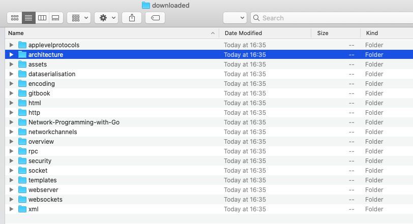

## 版本介绍

- 根据观察，目标网站大致结构如下
   - 章节首页的url一般是http://tumregels.github.io/Network-Programming-with-Go/architecture/
      - 其中architecture是章节名称
   - 章节内容一般为http://tumregels.github.io/Network-Programming-with-Go/architecture/protocol_layers.html
      - protocol_layers.html就是章节页面了
- 我们决定将爬取的所有东西都放在downloaded文件夹
- 如果downloaded文件夹不存在，会自动在当前文件夹中创建downloaded文件夹。
- 如果是章节首页，就会创建对应的文件夹并将章节首页以index.html形式保存在文件夹中
   - 如上文的architecture，会在downloaded文件夹中创建architecture文件夹，章节首页在architecture文件夹中被保存为index.html
- 如果是章节内容，则直接保存在对应章节的文件夹下，以url中的名称保存
   - 如上文的protocol_layers.html就会被保存在architecture文件夹
- 根据前文[目标网站元素](../ch3/README.md)中的观察，图片被存放于assets文件夹中，于是在downloaded文件夹中创建assets文件夹用来保存图片
- 当遇到图片时就按照url中的名称将图片保存在assets文件夹中
- 由于没有爬取CSS和javaScript文件，所以页面仅有文字和图片部分
- 由于章节首页如architecture在网页上的相对路径就为architecture，但保存为了index.html所以点击打开章节首页无法成功，Safari会打开architecture文件夹

