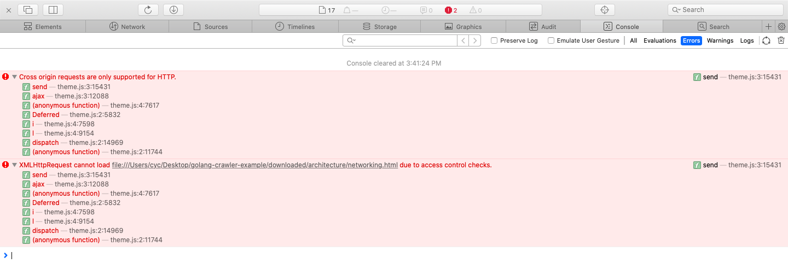
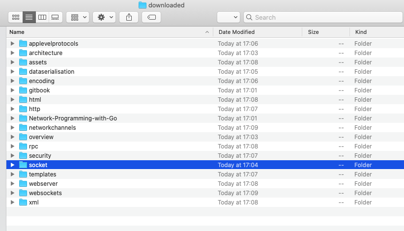
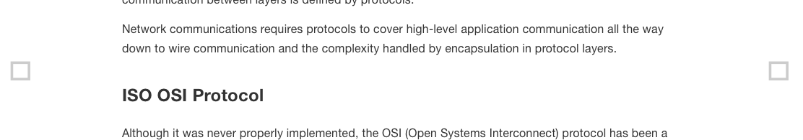

## 版本介绍

- 此版本增加了对于CSS和JavaScript文件的保存，使得保存的html打开展示和目标网站更加相近
- 根据前文[目标网站元素](../ch3/README.md)中的观察，CSS和JavaScript文件被存放于gitbook文件夹中，于是在downloaded文件夹中创建gitbook文件夹
- 当遇到JS或CSS文件时就按照url中的名称将文件保存在gitbook文件夹中
- 由于有些文件直接保存在gitbook文件夹，有些保存在gitbook文件夹下的文件夹中，所以在保存时根据url进行了判断，创建了部分文件夹，将所有文件都保存在了对应文件夹中

- 由于theme.js的代码导致了跨域请求的失败，所以网页间无法通过点击导航栏链接进入，可以在导航栏链接处以新标签页打开(Open Link in New Tab)

- 上一版本中的章节首页点开有误还是没有解决，打开章节首页，如socket时Safari仍然会打开所在的文件夹

- 此版本的保存还是有一些问题，导致indtroduction页面的CSS和JS没有被找到

- 此外，左上角的搜索功能还不能使用

- 此版本还存在页面的一些图标无法显示的问题

