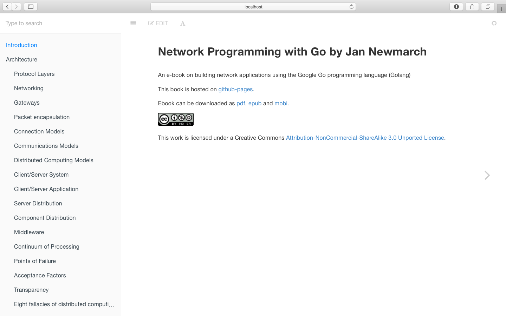
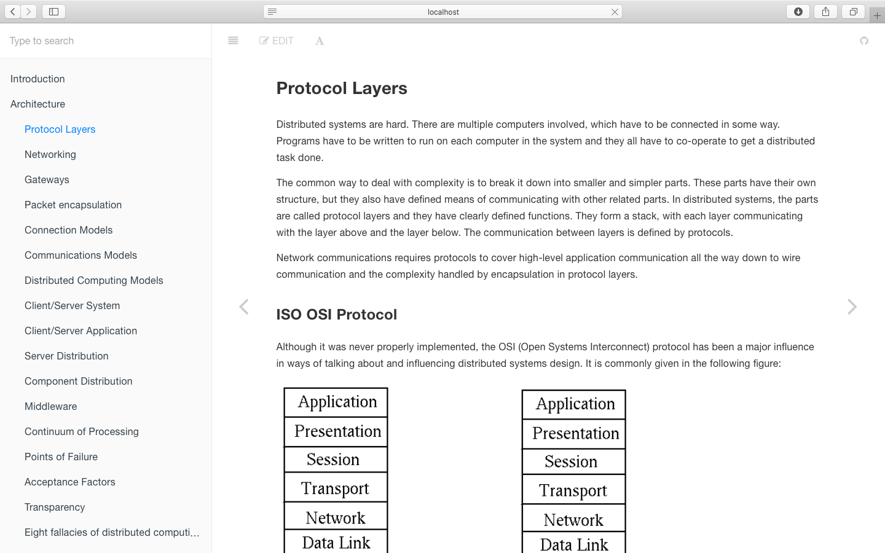
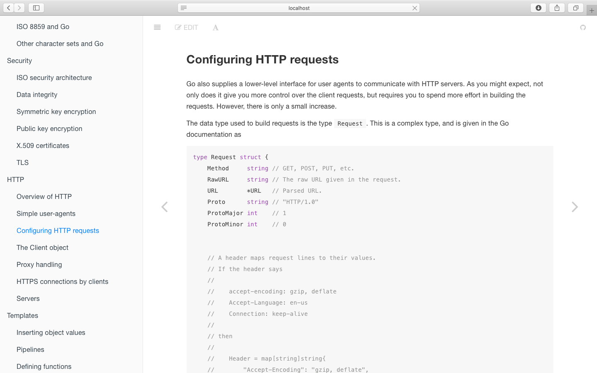
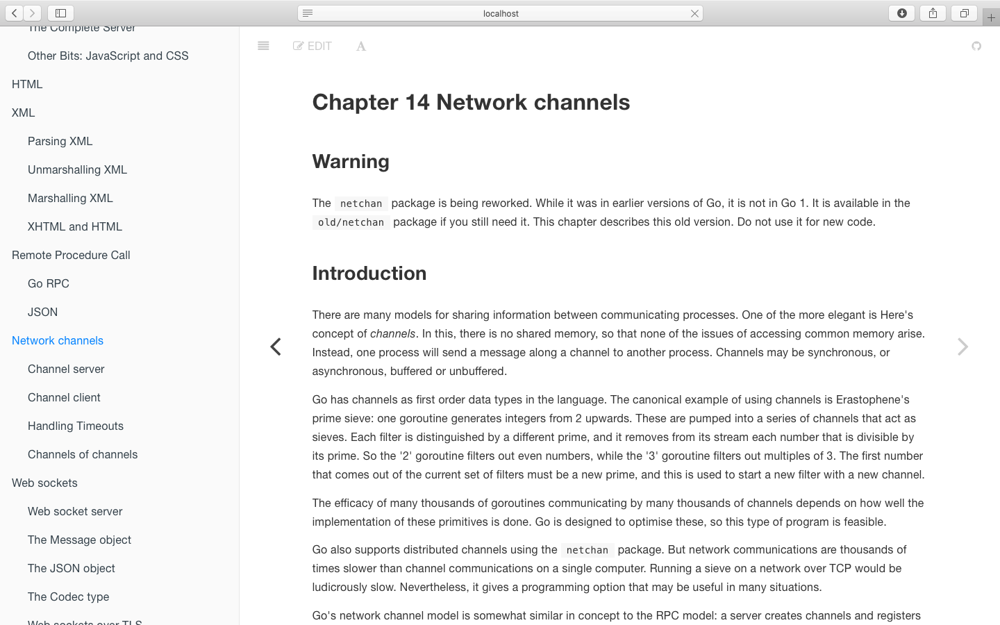
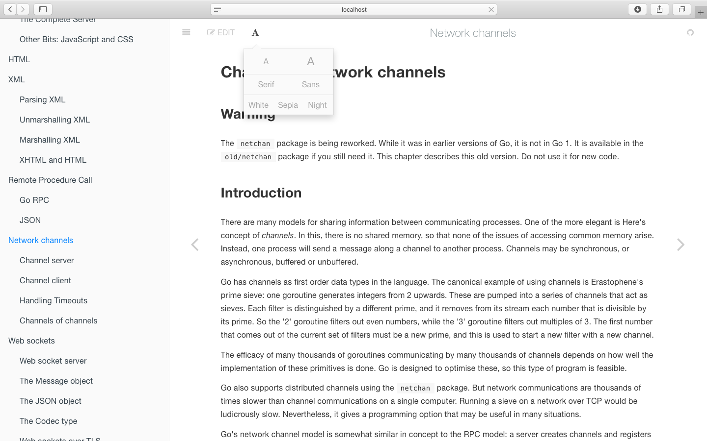
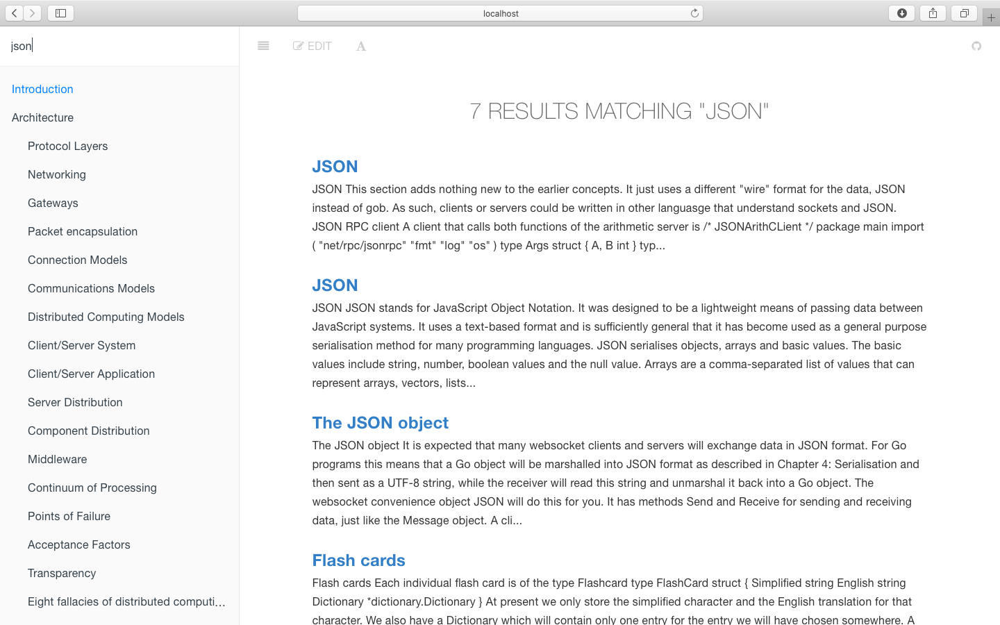

## 运行结果展示

### 运行

- 首先在命令行中运行爬虫爬取网站数据
```bash
go run crawlerv3.go
```

- 待爬虫爬取结束后，运行server
```bash
node server.js
```

- 打开浏览器输入网址localhost:3000即可访问网站首页——introduction页面

<div align=center></div>

### 结果展示
<div align=center></div>

<div align=center></div>

<div align=center></div>

<div align=center></div>

<div align=center></div>